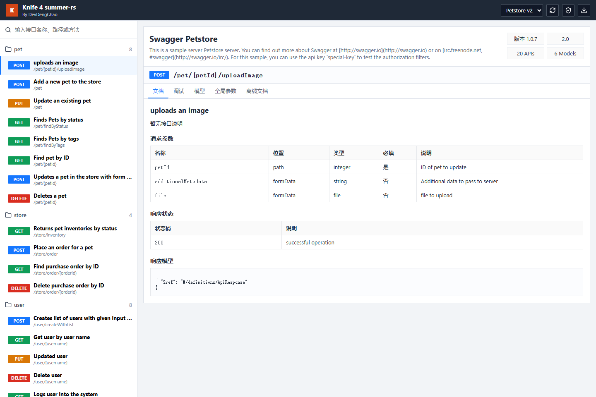

- [utoipa](#spring-utoipa)
  [](https://crates.io/crates/spring-utoipa)
  [](https://docs.rs/spring-utoipa):
  Utoipa offers compile time generated OpenAPI documentation for Rust.
- [knife-4-summer-rs](#knife-4-summer-rs)
  [](https://crates.io/crates/knife-4-summer-rs)
  [](https://docs.rs/knife-4-summer-rs):
  Knife4j-style OpenAPI documentation for `summer-rs` and direct `aide` / `axum` applications.

## Spring utoipa

[spring-utoipa](spring-utoipa) integrates
[utoipa](https://github.com/juhaku/utoipa) into spring-web, providing
auto-generated OpenAPI documentation.

For specific examples, please refer to the
[simple](https://github.com/spring-rs/contrib-plugins/tree/master/spring-utoipa/examples/simple),
[with-rapidoc](https://github.com/spring-rs/contrib-plugins/tree/master/spring-utoipa/examples/with-rapidoc),
[with-redoc](https://github.com/spring-rs/contrib-plugins/tree/master/spring-utoipa/examples/with-redoc),
[with-scalar](https://github.com/spring-rs/contrib-plugins/tree/master/spring-utoipa/examples/with-scalar)
or
[with-swagger-ui](https://github.com/spring-rs/contrib-plugins/tree/master/spring-utoipa/examples/with-swagger-ui)
project.

- Run the example

```shell
cargo run --color=always --package spring-utoipa --example with-scalar --features=scalar
```

## knife-4-summer-rs

[knife-4-summer-rs](knife-4-summer-rs) provides a Knife4j-style OpenAPI
documentation UI for `summer-rs`, while also exposing direct router helpers for
`aide` / `axum` applications.



The crate serves its Nuxt-generated static UI at both `/doc.html` and `/doc`,
and includes Knife4j-compatible discovery endpoints such as `/v3/api-docs`,
`/v3/api-docs/swagger-config`, `/swagger-resources`, and `/services.json`.

For specific examples, please refer to the
[summer-rs OpenAPI](https://github.com/summer-rs/contrib-plugins/tree/master/knife-4-summer-rs/examples/summer-openapi-example),
[aide / axum](https://github.com/summer-rs/contrib-plugins/tree/master/knife-4-summer-rs/examples/aide-axum-example)
or
[Petstore](https://github.com/summer-rs/contrib-plugins/tree/master/knife-4-summer-rs/examples/petstore-example)
project.

- Run the Petstore example

```shell
cargo run --color=always --package knife4j-petstore-example
```
